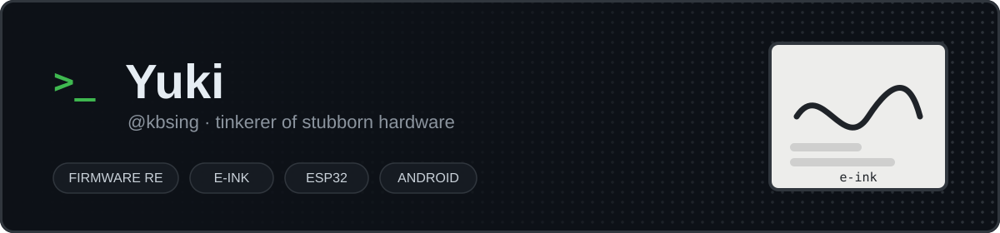

 

> 👋 **你好，我是 Yuki（@kbsing）。**
> 一个热衷于把硬件和固件折腾到听话为止的玩家：拆加密固件、给 Kindle / Boox / 裸墨水屏写刷新动画、
> 往 ESP32 里塞各种奇怪的功能，顺手再写几个 Android 应用和桌面工具。

## 🧭 最近在折腾

| 领域 | 在干什么 |
| --- | --- |
| 🖨️ **电子墨水屏** | 给 KPW5 做整页滑动动画、Waveshare 裸屏多帧 FAST 刷新模拟视频、墨水屏 dashboard，连刷新 LUT 都拆过 |
| 🔍 **固件逆向** | AES-GCM 加密固件容器、魔改 epdiy 条带刷新、各种官方"不让你改"的设备 |
| 📡 **ESP32 / 嵌入式** | Marauder 移植、ESP-NOW 无线 HID 透传、USB 功率计上位机（Rust + Tauri） |
| 📱 **Android** | 低端机友好的第三方网易云客户端、反射式测光表、漫画阅读器 |
| ⚡ **其他** | 本地 AI 推理（ncnn / Vulkan）、Godot 游戏开发、calibre 插件 |

## ⭐ 公开项目

| 项目 | 说明 |
| --- | --- |
| 📷 [**lumeter**](https://github.com/kbsing/lumeter) | LUMEN MK·I — 安卓反射式测光表，为手动曝光与胶片摄影而生 |
| 📊 [**wechat-radar**](https://github.com/kbsing/wechat-radar) | 微信聊天情报看板：群聊信号、话题、链接与趋势聚合 |
| 🎞️ [**open-kimi-ppt-skill**](https://github.com/kbsing/open-kimi-ppt-skill) | 让 AI Agent 生成可编辑 PPTD / PPTX 的 Kimi Slides Skill，附本地浏览器编辑器 |
| 🎬 [**jianying-headless**](https://github.com/kbsing/jianying-headless) | 原生解析剪映草稿，隔离编辑与导出，附独立 Agent Skill |
| 🌗 [**x-ambient**](https://github.com/kbsing/x-ambient) | 把 X 时间线上的图片和视频变成整个页面的环境光 |
| 🖨️ [**eink-dashboard**](https://github.com/kbsing/eink-dashboard) | 墨水屏仪表盘 |
| 📖 [**onyx-png-screensaver**](https://github.com/kbsing/onyx-png-screensaver) | Boox 阅读器 PNG 屏保工具 |
| 📚 [**PicACGComic**](https://github.com/kbsing/PicACGComic) | Kotlin 写的安卓漫画阅读器 |

## 🛠️ 常用工具链

---

对着墨水屏发呆的时候，大概率只是在等它刷新完。 🖨️

